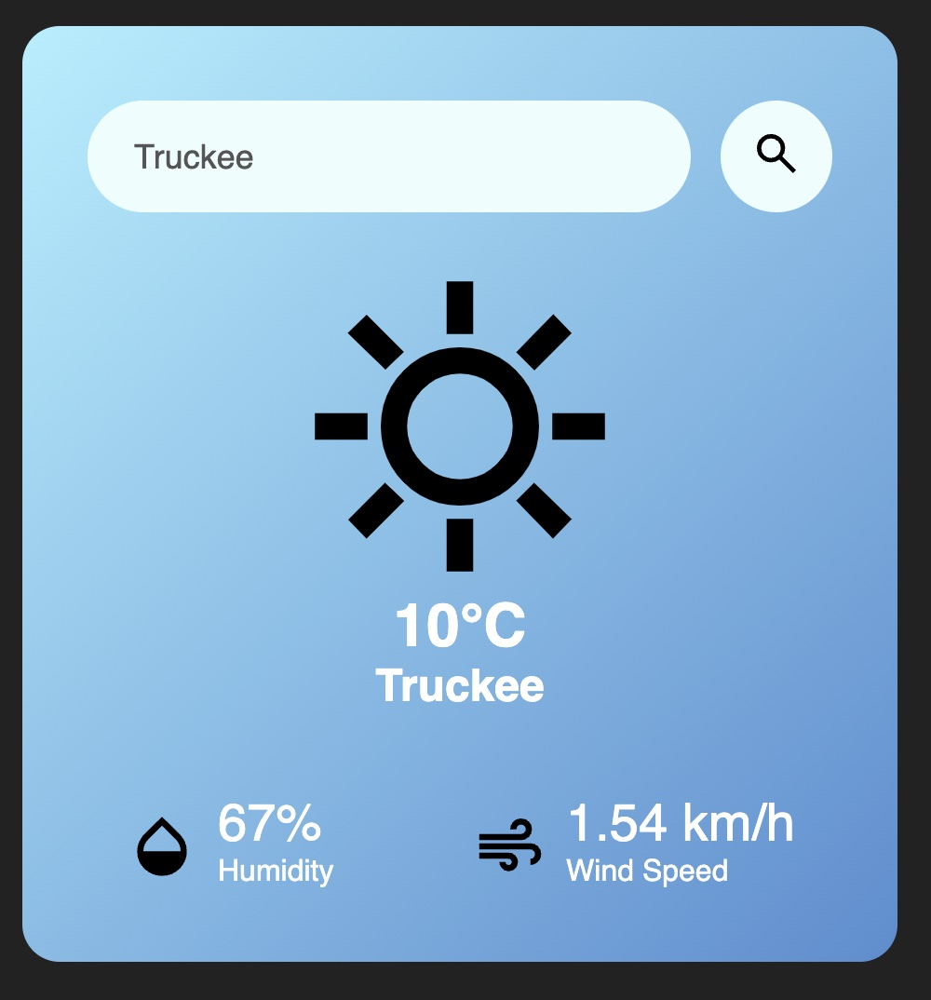
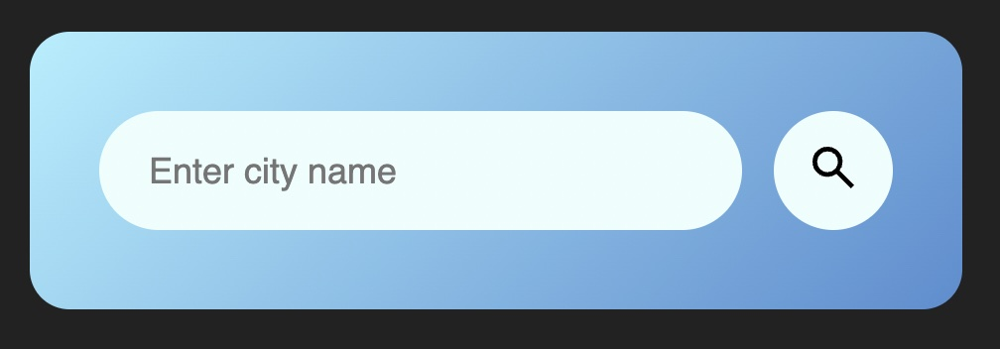
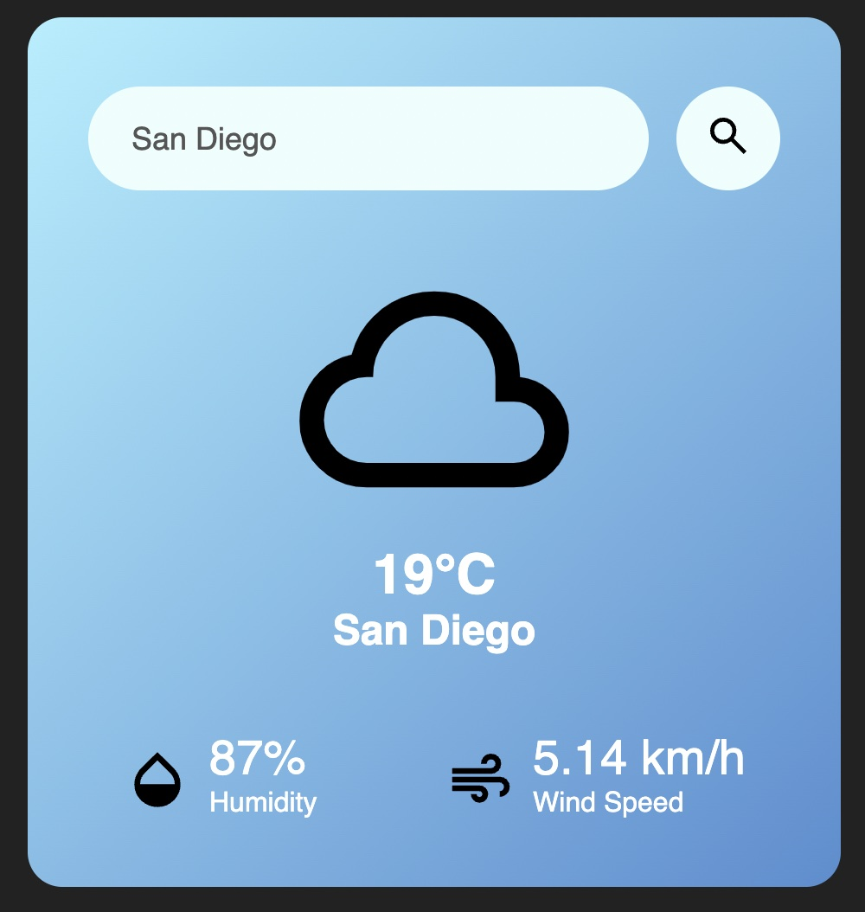

# Simple Weather Web App
Weather web app widget using `HTML, CSS, JS, OpenWeather API`

Workflow:
1. Structure HTML
2. Style CSS
3. API Call - fetch(); async & await method
4. Finishing Details

## OpenWeather API
OpenWeatherMap is an online service that provides global weather data via API, including current weather data, forecasts, nowcasts and historical weather data for any geographical location. The company provides a minute-by-minute hyperlocal precipitation forecast for any location.
[Current weather data](https://openweathermap.org/current#name)

### Built-in API request by city name
**API call**  
`https://api.openweathermap.org/data/2.5/weather?q={city name}&appid={API key}`

### Format
Response format is JSON by default. To get data in XML format just set up  
mode = xml.

